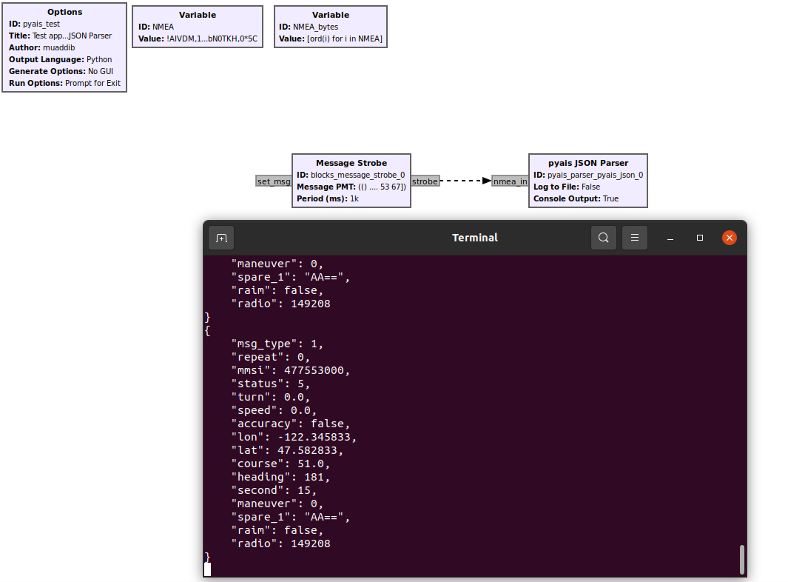
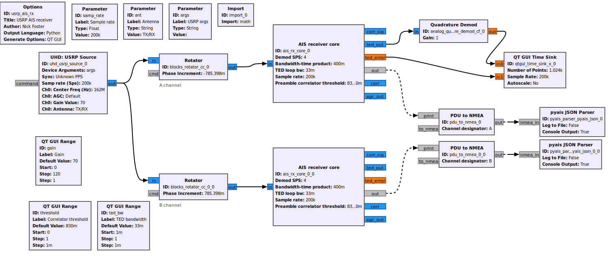

# gr-PyAIS
gr-PyAIS is a wrapper around the [pyais python module](https://github.com/M0r13n/pyais)
It is intended to be used in conjunction with gr-ais. Currently the updated repo for GNURadio maint-3.10 is 
a [fork of gr-ais by bkerler](https://github.com/bkerler/gr-ais/tree/maint-3.10)
### DEPENDENCIES
pyais

```pip install pyais```
### USAGE
Test the block using the example flowgraph ```examples/pyais_test.grc```

When run, the flowgraph will open a terminal and show json formatted AIS message data as shown below.



To run with gr-ais (maint-3.10 linked above), simply connect the output of the PDU to NMEA block to the input of the
pyais JSON Parser shown below as an add-in to the existing gr-ais example flowgraph ```usrp_ais_rx.grc```.



#### Block Parameters
gr-pyais_json has two parameters that can be enabled/disabled: 
* Console Output: This turns console output on and off.
* Log to File: if set to True, a filename dropdown will appear. The file format is JSON and any filename can be used.
  * The JSON file write is in 'append' mode, so no overwriting of the log will occur if the flowgraph is stopped and restarted

Suggestions welcome in the form of Github Issues. 
Changes welcom in the form of Github Pull Requests.


